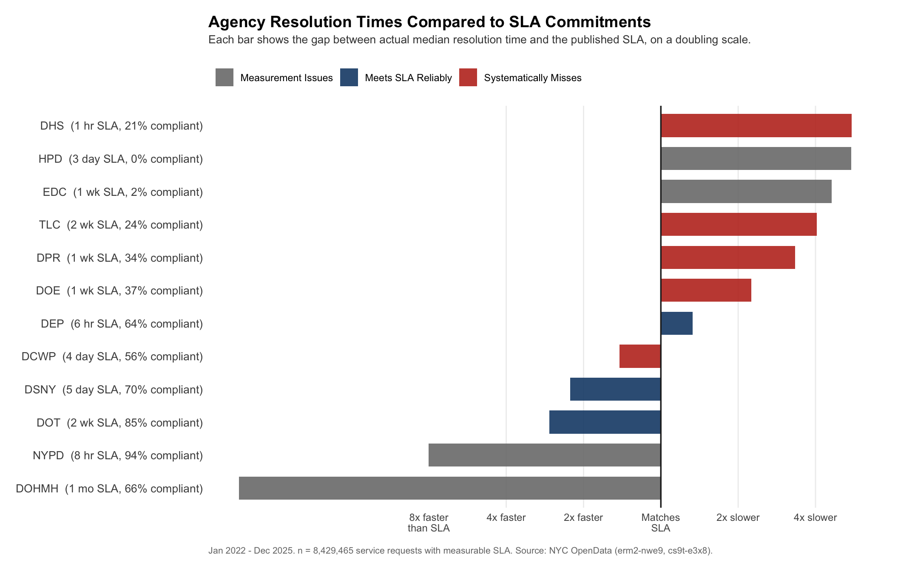
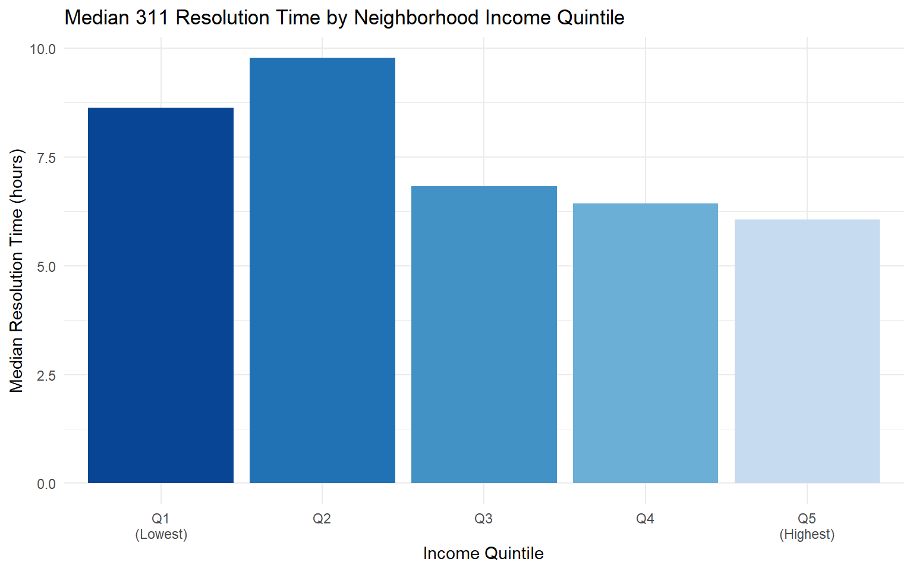
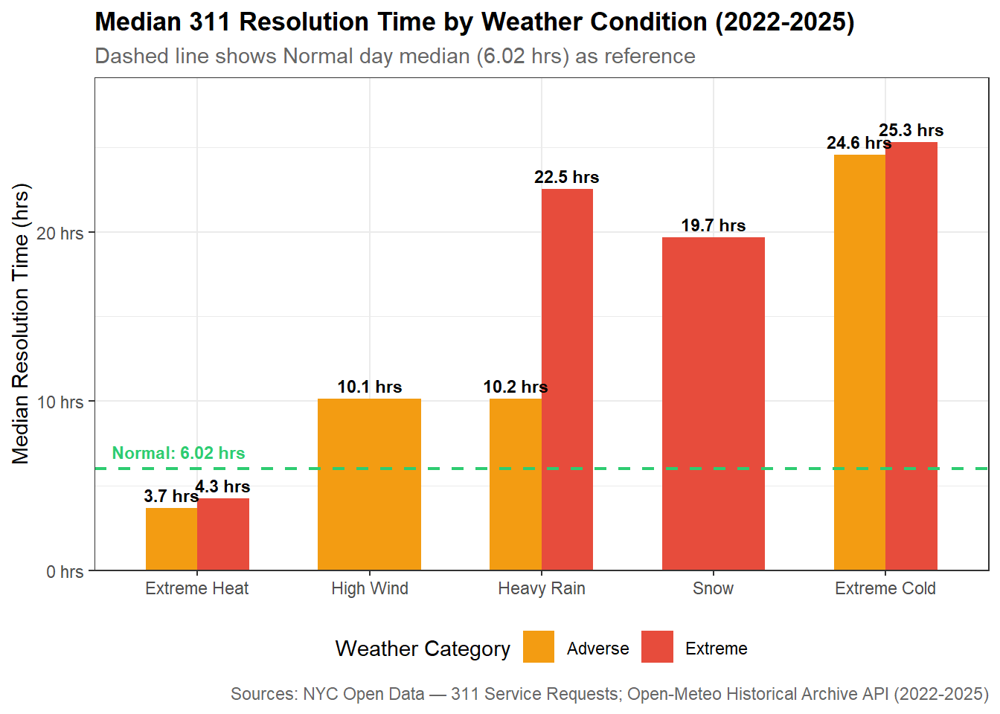
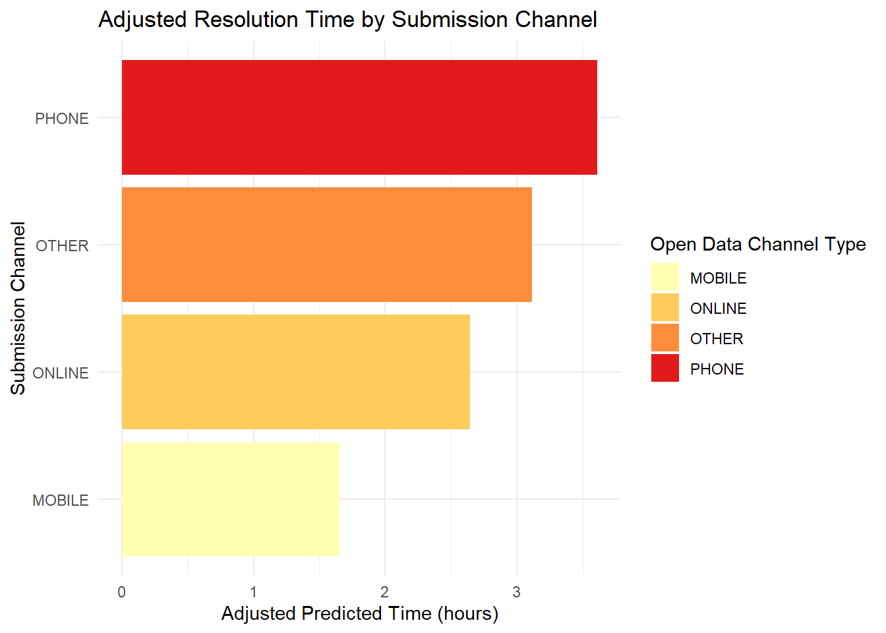

<script>
  document.addEventListener("DOMContentLoaded", function() {
    var titleEl = document.querySelector(".quarto-title .title");
    if (titleEl) {
      var img = document.createElement("img");
      img.src = "https://raulsolanavarro.github.io/STA9750-2026-SPRING/figures/nyc311_logo.png";
      img.setAttribute("style", "height: 6rem !important; width: auto !important; vertical-align: middle; margin-right: 0.6rem; margin-bottom: 0.2rem;");
      titleEl.prepend(img);
    }
  });
</script>

```{r setup, include=FALSE}
knitr::opts_chunk$set(echo = FALSE, warning = FALSE, message = FALSE)
```

---

## Why 311 Matters

New York City's 311 system receives three to four million service requests every year. Residents use it to report heating failures in January, noise complaints at midnight, potholes that have persisted through multiple winters, and housing conditions that no tenant should be expected to tolerate. In principle, 311 functions as an equalizer: a single platform connecting every resident to the city agency responsible for addressing their concern, regardless of borough, income level, or familiarity with city government.

In practice, resolution times vary by orders of magnitude. Some complaints are closed within minutes. Others remain open for months. Whether that variation reflects the inherent complexity of different problem types, or something more structural about how the city allocates attention and resources across its population, is a question with material consequences for residents. It is also a question that can now be examined empirically, given the richness of the administrative data the city makes publicly available.

This report summarizes the findings of a four-part analysis conducted as the capstone project for STA 9750 at Baruch College. The central question is: **What factors drive 311 service request response and resolution times, and do they suggest segmented prioritization of issues?** The four sub-analyses examine agency SLA compliance, neighborhood income, weather, and submission method, covering the institutional, demographic, environmental, and behavioral dimensions of service delivery. The dataset spans more than 13 million closed service requests from January 2022 through December 2025.

---

## Prior Work and the Gap This Project Fills

The academic and policy literature on 311 service delivery is narrower than one might expect given the platform's scale. The New York City Council published a review of agency responsiveness in 2018 that identified substantial variation across agencies but did not investigate the underlying causes. The city's own 311 Reporting dashboards aggregate SLA compliance across all agencies as a single figure, which prevents identification of which agencies are performing well and which are not. The *State of NYC311* report, released in 2023 to mark the platform's twentieth anniversary, observes that call volume rises during major weather events but does not quantify the effect of weather on resolution time in a systematic way.

This project contributes four distinct extensions to that literature: more current data (2022 to 2025), a systematic comparison of resolution times against SLA targets across all major agencies simultaneously, income effects examined at the census tract level rather than the borough level, and weather treated as a quantitative variable with defined severity thresholds. No prior published work is known to combine all four of these elements for NYC 311 data. Where prior work documented variation in 311 response times without explaining it, this project identifies complaint type as the structural mediator connecting income, weather, channel, and SLA coverage into a single coherent account.

---

## Data Sources and Their Limitations

The primary dataset is the NYC Open Data 311 Service Requests file, which records each inbound request with its creation date, closure date, complaint type, responding agency, borough, and geographic coordinates. After filtering to closed requests with valid timestamps and reasonable resolution-time bounds, the working dataset contains between 12.6 and 13.5 million records depending on the specific analysis described in the individual reports.

Three supplementary sources were joined to this base. The **NYC Open Data 311 Service Level Agreements** lookup table provides the response-time commitments each agency has published for each complaint type. **American Community Survey** five-year estimates, accessed via the `tidycensus` R package, provided median household income at the census tract level for all five boroughs. The **Open-Meteo Historical Archive API** supplied daily weather records for 16 geographic points across the boroughs, enabling classification of each day as Normal, Adverse, or Extreme along five weather dimensions.

Several limitations apply across all four analyses. The "closed" status in the 311 dataset does not confirm that the underlying problem was resolved, as agencies can close a ticket administratively. ACS income estimates reflect a five-year average anchored to 2023 and carry missing values for 5.8 percent of tracts and high margins of error for another 11 percent. Weather data is daily and borough-scale, smoothing out short-duration events and within-borough variation. Most significantly, the SLA coverage gap is not random: nearly 90 percent of requests that could not be matched to any published SLA target are HPD habitability complaints, including heat, hot water, and plumbing categories, which are among those most commonly filed by lower-income tenants. This structural gap is itself an important finding, discussed further in the SLA compliance section below.

---

## Findings

### Agency SLA Compliance: Three Operational Regimes

Mary Lycke's analysis compared actual resolution times against published SLA targets across all major city agencies, computing for each the ratio of median resolution time to its published commitment. The results organize agencies into three distinct groups.

The **Department of Transportation (DOT)** and the **Department of Sanitation (DSNY)** are reliable performers. DOT resolves its typical request at roughly 37 percent of its SLA commitment with an 85 percent compliance rate, and DSNY at 44 percent of its commitment with 70 percent compliance. The **Department of Environmental Protection (DEP)** resolves its median request slightly past its target but maintains 64 percent compliance. These agencies demonstrate that consistent SLA performance is operationally achievable at scale.

A second group systematically misses commitments. The **Department of Parks and Recreation (DPR)** has a median resolution ratio of 3.3 times its SLA and a 34 percent compliance rate. The **Taxi and Limousine Commission (TLC)** runs at 4.0 times its SLA with 24 percent compliance. The **Department of Education (DOE)** and the **Department of Homeless Services (DHS)** show compliance rates of 37 and 21 percent respectively, with patterns consistent across years and complaint types, suggesting operational rather than incidental failures.

Four agencies exhibit measurement irregularities that prevent meaningful evaluation. **NYPD** records 94 percent SLA compliance with a median resolution time under one hour against an eight-hour target across all 23 complaint types, including categories such as Blocked Driveway and Animal Abuse where sub-hour physical resolution is implausible. This pattern is consistent with tickets being closed on dispatch rather than upon resolution of the underlying problem. **DOHMH** and **EDC** show apparent resolution times in the range of years, reflecting bulk administrative closure events rather than genuine service delivery. **HPD** has a 0.3 percent ticket closure rate and 0 percent SLA compliance among those that do close.

The structural gap noted earlier connects directly to these results: the complaint categories with no published SLA, dominated by HPD habitability issues, are also among the most consequential for lower-income residents, and the agencies with the most unreliable measurement practices are handling some of the highest request volumes.

{fig-alt="Diverging bar chart of agency SLA compliance ratios"}

::: {.callout-gold}
**Key finding:** DOT and DSNY reliably meet their SLA commitments. DPR, TLC, DOE, and DHS systematically miss theirs. NYPD, DOHMH, EDC, and HPD cannot be meaningfully evaluated with available data due to measurement irregularities.
:::

[📝 **Full technical report (Mary Lycke)**](https://mclycke.github.io/STA9750-2026-SPRING/individual_report)

---

### Neighborhood Income: Complaint Type Mediates the Disparity

Raúl J. Solá Navarro's analysis spatially joined 12.6 million closed 311 requests to census tract income data and grouped tracts into five income quintiles. In the unadjusted data, the lowest-income quintile (Q1) has a median resolution time of 8.64 hours, compared to 6.06 hours for the highest-income quintile (Q5), a difference of approximately 43 percent. Notably, Q2 at 9.78 hours is the slowest quintile overall, suggesting the relationship between income and resolution time does not follow a simple low-to-high progression even before any controls are applied.

A regression controlling for complaint type and borough reveals that the apparent income gradient largely reflects differences in what neighborhoods tend to report rather than differential treatment of similar requests. After controls, the income effects across quintiles are small, inconsistent in direction, and statistically indistinguishable from zero for all quintiles except Q4. Bootstrap confidence intervals based on 200 iterations confirm this finding.

A scatter plot of tract-level income against median resolution time, smoothed with a loess curve, illustrates the relationship visually: resolution times rise modestly through the middle of the income distribution, then decline at the upper end, with wide vertical spread throughout. A side-by-side map of median household income and median 311 resolution time by census tract confirms that the two spatial patterns do not closely mirror each other.

The finding is not exculpatory of the system. Lower-income neighborhoods are concentrated in the complaint types that are slowest to resolve by nature, least covered by published SLA targets, and most likely to fall into the HPD habitability category where data quality is poorest. The disparity is real; it is simply not the product of agencies treating similar requests differently based on neighborhood income.

{fig-alt="Bar chart of median resolution time by income quintile"}

::: {.callout-gold}
**Key finding:** Lower-income census tracts experience 43% longer raw resolution times than higher-income tracts. After controlling for complaint type and borough, the income effect is modest and does not follow a simple high-to-low pattern across quintiles. The disparity is primarily mediated by what types of problems different neighborhoods face, not by differential agency prioritization within complaint categories.
:::

[📊 **Full technical report (Raúl J. Solá Navarro)**](https://raulsolanavarro.github.io/STA9750-2026-SPRING/individual_report_raul.html)

---

### Weather: An Unequal Amplifier Across Agency Types

Evelyn Rodriguez's analysis matched 12.9 million service requests to daily weather records using a nearest-neighbor spatial join across 16 borough weather stations. Days were classified as Normal, Adverse, or Extreme across five weather dimensions: cold temperature, heat, heavy rain, high wind, and snow.

At the system level, median resolution time is 2.5 times longer on Adverse days and 3.4 times longer on Extreme days relative to the Normal-day baseline of 6.02 hours. Notably, the spread of resolution times also widens with severity, meaning weather does not impose a uniform delay but rather produces a bifurcated response in which some complaints are resolved faster while others fall significantly behind. This widening is itself evidence of implicit prioritization during adverse conditions.

Among weather types, extreme cold produces the longest resolution times overall, with a system-wide median of 25.3 hours, driven primarily by a surge in heat and hot water complaints that are physically constrained by heating system access. Extreme heat is the only condition associated with faster-than-normal resolution times, a result that partly reflects complaint mix shifts and partly reflects automated closure patterns in DEP water system data. Snow events produce median times of 19.7 hours, and heavy rain in combination with a secondary hazard reaches 22.5 hours.

The type of work an agency does largely determines its weather sensitivity. DOHMH shows the most consistent slowdown in cold and snowy conditions, approximately 44 percent longer than its baseline, consistent with field inspection work being physically constrained. HPD slows most substantially during extreme heat, driven by a complaint surge that outpaces capacity. DPR appears to speed up during storms, but this reflects a composition shift rather than operational improvement: damaged tree complaints flood in and resolve quickly as crews deploy, pulling the agency median down. NYPD, TLC, and DCWP show negligible sensitivity across all weather categories, consistent with work conducted through dispatch and administrative processes rather than field operations.

{fig-alt="Grouped bar chart of median resolution time by weather condition and severity"}

::: {.callout-gold}
**Key finding:** Adverse weather increases median resolution times 2.5x system-wide, with Extreme days reaching 3.4x longer than normal. Field-based agencies slow substantially; enforcement and administrative agencies are largely unaffected. Extreme cold is the most disruptive condition. The complaint types most affected by weather (heat, water, storm damage) are also those concentrated in lower-income neighborhoods.
:::

[📈 **Full technical report (Evelyn Rodriguez)**](https://er0driguez.github.io/STA9750-2026-SPRING/individual_report)

---

### Submission Method: Channel Effects Are Largely Explained by Complaint Mix

Xiyao (Jackie) Chen's analysis examined 12 million service requests across four submission channels: mobile app, online web form, phone, and other. A weighted linear regression of log-transformed resolution time was estimated, controlling for borough, problem category, and agency.

The adjusted predicted resolution times rank as follows: mobile (1.65 hours), online (2.64 hours), other (3.11 hours), and phone (3.61 hours). The mobile channel has the shortest average resolution time, and the ordering holds before and after controls. However, the channel effect is weak in absolute terms: agency identity and complaint category account for the overwhelming share of explained variation in the model, and the channel differences are statistically detectable only because of the large sample size, not because the effects are meaningfully large in practice.

The ranking reflects user behavior more than platform processing. Mobile and online submissions skew heavily toward noise complaints and illegal parking violations, both of which route to NYPD and close quickly regardless of channel. Phone submissions carry a substantially higher share of heat and hot water complaints, unsanitary conditions, and housing issues, which resolve slowly regardless of how they were filed. A reopen-rate analysis further illustrates this: approximately 600,000 duplicate or reopened submissions appear in the dataset, with phone submissions accounting for the largest share and unsanitary conditions as the most common repeated complaint type, suggesting that unresolved underlying problems drive residents to call back.

{fig-alt="Horizontal bar chart of adjusted predicted resolution time by submission channel"}

::: {.callout-gold}
**Key finding:** Mobile submissions have the shortest average resolution times, but the channel effect is weak in absolute terms and largely explained by the types of complaints each channel attracts. Agency and complaint category predict resolution time far more strongly than submission method. There is no universally best channel; the optimal choice depends on the type of problem being reported.
:::

[📑 **Full technical report (Xiyao Jackie Chen)**](https://jackeee101.github.io/STA9750-2026-SPRING/project.html)

---

## Integrating the Four Analyses

| Factor | Raw Association with Resolution Time | After Controls |
|:---|:---|:---|
| Agency SLA Compliance | Compliance rates from 0% to 94% across agencies | Structural and persistent; reflects agency operational regimes |
| Neighborhood Income | Lowest-income tracts wait 43% longer (median) | Largely mediated by complaint type; small residual income effect |
| Weather Severity | Adverse days 2.5x longer; Extreme days 3.4x longer | Varies strongly by agency type (field vs. enforcement) |
| Submission Channel | Mobile fastest; phone slowest | Largely mediated by complaint type and user behavior |

The four analyses point to the same conclusion: **complaint type is the master variable.** It determines which agency handles a request, how long resolution takes by physical necessity, whether a published SLA target exists, and which populations tend to file it. The apparent effects of income, weather, and submission channel are largely downstream of this single structural fact.

The quantitative case is concrete. HPD habitability complaints, which have no SLA coverage, drive the bulk of the 43 percent raw income gap between the lowest and highest quintile tracts, and those same complaint types surge most during the extreme cold events that produce the longest system-wide delays. The residents most likely to wait longest are doing so for the same reason across all four analyses: they are filing complaints the city's accountability infrastructure was not designed to handle efficiently.

This is not an exoneration of the system. The framework is most complete and most transparent for the complaint types that tend to come from higher-income neighborhoods. For the complaints that matter most to lower-income renters, it offers less coverage, less reliable data, and less accountability. That gap reflects structural choices, not deliberate prioritization, but the effect on residents is the same.

---

## Directions for Future Work

Several analytical extensions would materially strengthen these findings. Extending the time horizon back to 2018 would enable pre- and post-COVID comparison of both volume trends and resolution time patterns. Incorporating additional ACS variables, including poverty rate and housing tenure, would provide a more granular picture of the socioeconomic determinants of filing behavior. On the weather dimension, replacing the 16-point borough-level station grid with a denser coordinate grid would capture hyper-local variation currently averaged out of the analysis. Most fundamentally, partnering with city agencies to obtain verified resolution confirmation, rather than relying on the administrative "closed" timestamp, would transform the evidentiary basis for all four analyses.

---

## Individual Technical Reports

<div class="report-link-grid">
<div class="report-link-card">
📋 **Agency SLA Compliance**<br>
Mary Lycke<br>
[→ View full report](https://mclycke.github.io/STA9750-2026-SPRING/individual_report)
</div>
<div class="report-link-card">
🗺️ **Neighborhood Income Effects**<br>
Raúl J. Solá Navarro<br>
[→ View full report](https://raulsolanavarro.github.io/STA9750-2026-SPRING/individual_report_raul.html)
</div>
<div class="report-link-card">
🌦️ **Weather and Resolution Time**<br>
Evelyn Rodriguez<br>
[→ View full report](https://er0driguez.github.io/STA9750-2026-SPRING/individual_report)
</div>
<div class="report-link-card">
📱 **Submission Channel Effects**<br>
Xiyao (Jackie) Chen<br>
[→ View full report](https://jackeee101.github.io/STA9750-2026-SPRING/project.html)
</div>
</div>

---

## Data Sources

::: {.data-footer}

| Dataset | Provider | Coverage | Used For |
|:---|:---|:---|:---|
| 311 Service Requests (erm2-nwe9) | NYC Open Data | Jan 2022 – Dec 2025 | Primary dataset for all analyses |
| 311 Service Level Agreements (cs9t-e3x8) | NYC Open Data | Current at time of analysis | SLA compliance benchmarks |
| American Community Survey, 5-year estimates | U.S. Census Bureau via `tidycensus` | 2019 – 2023 | Median household income by census tract |
| Historical Archive API | Open-Meteo | Jan 2022 – Dec 2025 | Daily weather records for 16 NYC points |

- **Analysis window:** January 1, 2022 through December 31, 2025.
- **Course:** STA 9750, Baruch College, Spring 2026.
- **Group:** 3-1-Fun! (Group 2).

:::

---

::: {.callout-note collapse="true"}
## 🤖 AI Usage Statement

Claude (Anthropic) was used to assist with the technical construction of this summary report, including Quarto document structure, CSS styling and branding, figure placement, and debugging rendering issues. Claude was also used to help identify a coherent framework for integrating the four individual analyses into a unified narrative. All prose, analysis, conclusions, and written content in this report are the original work of the project team. Claude was not used to write, edit, or generate any text appearing in the report body, nor was it used in any of the four individual technical reports.
:::